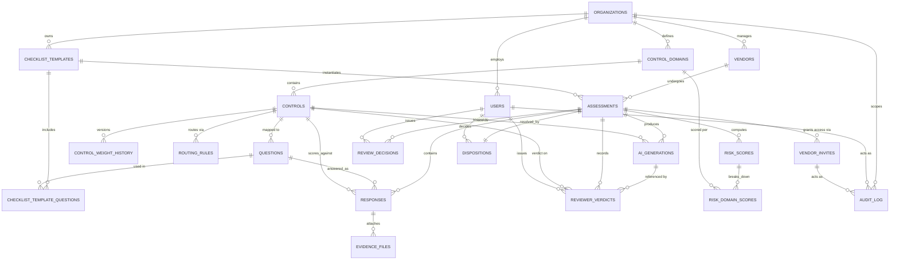

# VSA Platform — Database Schema (PostgreSQL)

Derived from `SCREENS.md` / `VSA Wireframes.dc.html`. Multi-tenant (one row per organization/customer of the GRC platform), RBAC-enforced at query layer, audit-immutable per the functional spec.

---

## 1. Entities Overview

| Entity | Purpose |
|---|---|
| `organizations` | Tenant boundary (the company running the GRC platform) |
| `users` | Internal staff: Admin, Cybersecurity Reviewer, Legal Reviewer, Risk Manager |
| `roles` | Fixed RBAC role enum table |
| `vendors` | Third parties being assessed |
| `vendor_invites` | Time-bound token access for vendor respondents (no standing account) |
| `control_domains` | Logical groupings (Access Control, Third-Party Mgmt, Incident Response, etc.) |
| `controls` | SCF (or custom) controls with weight, versioned |
| `control_weight_history` | Append-only version log of weight/routing changes |
| `questions` | Question bank, each mapped 1:1 to a control |
| `checklist_templates` | A named, versioned bundle of questions assigned to vendors |
| `checklist_template_questions` | Join: which questions belong to which template, in what order |
| `assessments` | One vendor's run of a checklist template (the "case") |
| `responses` | Vendor's answer to a single question within an assessment |
| `evidence_files` | Metadata only for uploaded evidence (no raw file content in DB) |
| `routing_rules` | Which reviewer role(s) a control/domain routes to |
| `ai_generations` | Immutable log of every AI prompt + response (summary/gap/remediation) |
| `reviewer_verdicts` | Reviewer's accept/edit/override action per control per assessment |
| `review_decisions` | Reviewer-role-level decision (Approve/Request Info/Escalate/Reject) per assessment |
| `risk_scores` | Computed aggregate + domain sub-score snapshot per assessment |
| `dispositions` | Risk Manager's final Approve/Conditional/Reject decision |
| `audit_log` | Immutable, append-only trail for every state-changing action platform-wide |

---

## 2. DDL

```sql
-- ============================================================
-- EXTENSIONS
-- ============================================================
create extension if not exists "pgcrypto"; -- for gen_random_uuid()

-- ============================================================
-- ENUM TYPES
-- ============================================================
create type user_role as enum ('admin', 'cyber_reviewer', 'legal_reviewer', 'risk_manager');

create type response_value as enum ('compliant', 'non_compliant', 'not_applicable');

create type control_source as enum ('scf', 'custom');

create type assessment_status as enum (
  'draft', 'sent', 'in_progress', 'submitted',
  'in_review', 'escalated', 'approved', 'conditional', 'rejected'
);

create type reviewer_action as enum ('accept', 'edit', 'override');

create type review_decision_value as enum ('approve', 'request_info', 'escalate', 'reject');

create type disposition_value as enum ('approve', 'conditional', 'reject');

create type ai_generation_kind as enum ('summary', 'gap_analysis', 'remediation', 'briefing', 'cross_domain_note');

create type criticality_tier as enum ('low', 'medium', 'high', 'critical');

-- ============================================================
-- ORGANIZATIONS & USERS
-- ============================================================
create table organizations (
  id           uuid primary key default gen_random_uuid(),
  name         text not null,
  created_at   timestamptz not null default now()
);

create table users (
  id             uuid primary key default gen_random_uuid(),
  organization_id uuid not null references organizations(id) on delete cascade,
  email          citext not null,
  full_name      text not null,
  role           user_role not null,
  is_active      boolean not null default true,
  created_at     timestamptz not null default now(),
  updated_at     timestamptz not null default now(),
  unique (organization_id, email)
);

create index idx_users_org_role on users(organization_id, role);

-- ============================================================
-- VENDORS & TOKEN-BASED INVITES
-- ============================================================
create table vendors (
  id               uuid primary key default gen_random_uuid(),
  organization_id  uuid not null references organizations(id) on delete cascade,
  name             text not null,
  primary_contact_email citext,
  criticality_tier criticality_tier,           -- set by TPM-02 criticality assessment
  created_at       timestamptz not null default now(),
  updated_at       timestamptz not null default now()
);

create index idx_vendors_org on vendors(organization_id);

create table vendor_invites (
  id             uuid primary key default gen_random_uuid(),
  vendor_id      uuid not null references vendors(id) on delete cascade,
  assessment_id  uuid not null references assessments(id) on delete cascade,
  token_hash     text not null unique,          -- hash of the bearer token, never store raw token
  issued_by      uuid references users(id),
  issued_at      timestamptz not null default now(),
  expires_at     timestamptz not null,
  redeemed_at    timestamptz,                   -- first successful access
  revoked_at     timestamptz
);

create index idx_invites_expiry on vendor_invites(expires_at);

-- ============================================================
-- CONTROL LIBRARY
-- ============================================================
create table control_domains (
  id               uuid primary key default gen_random_uuid(),
  organization_id  uuid not null references organizations(id) on delete cascade,
  name             text not null,               -- e.g. "Third-Party Management"
  sort_order       int not null default 0,
  unique (organization_id, name)
);

create table controls (
  id               uuid primary key default gen_random_uuid(),
  organization_id  uuid not null references organizations(id) on delete cascade,
  control_domain_id uuid not null references control_domains(id),
  control_code     text not null,               -- e.g. 'TPM-05.1', 'CUS-02'
  title            text not null,
  description      text,
  source           control_source not null default 'scf',
  framework_ref    text,                        -- e.g. 'SCF 2026.1'
  current_weight   smallint not null check (current_weight between 1 and 10),
  is_deprecated    boolean not null default false, -- soft-delete only; never hard-deleted if in use
  created_at       timestamptz not null default now(),
  updated_at       timestamptz not null default now(),
  unique (organization_id, control_code)
);

create index idx_controls_domain on controls(control_domain_id);

-- Append-only version history for weight/routing edits (Admin console 1j)
create table control_weight_history (
  id             uuid primary key default gen_random_uuid(),
  control_id     uuid not null references controls(id) on delete cascade,
  weight         smallint not null check (weight between 1 and 10),
  changed_by     uuid not null references users(id),
  changed_at     timestamptz not null default now(),
  reason         text
);

create index idx_weight_history_control on control_weight_history(control_id, changed_at);

-- Which reviewer role(s) a control routes to (Admin console 1j — Routing tab)
create table routing_rules (
  id           uuid primary key default gen_random_uuid(),
  control_id   uuid not null references controls(id) on delete cascade,
  role         user_role not null check (role in ('cyber_reviewer','legal_reviewer','risk_manager')),
  unique (control_id, role)
);

-- ============================================================
-- QUESTION BANK & CHECKLIST TEMPLATES
-- ============================================================
create table questions (
  id             uuid primary key default gen_random_uuid(),
  organization_id uuid not null references organizations(id) on delete cascade,
  control_id     uuid not null references controls(id),
  question_text  text not null,
  help_text      text,
  requires_evidence boolean not null default false,
  is_active      boolean not null default true,
  created_at     timestamptz not null default now(),
  updated_at     timestamptz not null default now()
);

create index idx_questions_control on questions(control_id);

create table checklist_templates (
  id              uuid primary key default gen_random_uuid(),
  organization_id uuid not null references organizations(id) on delete cascade,
  name            text not null,               -- e.g. "Standard Third-Party VSA v3"
  version         int not null default 1,
  is_active       boolean not null default true,
  created_at      timestamptz not null default now()
);

create table checklist_template_questions (
  id                    uuid primary key default gen_random_uuid(),
  checklist_template_id uuid not null references checklist_templates(id) on delete cascade,
  question_id           uuid not null references questions(id),
  sort_order             int not null default 0,
  unique (checklist_template_id, question_id)
);

-- ============================================================
-- ASSESSMENTS (a vendor's run of a checklist)
-- ============================================================
create table assessments (
  id                    uuid primary key default gen_random_uuid(),
  organization_id       uuid not null references organizations(id) on delete cascade,
  vendor_id             uuid not null references vendors(id) on delete cascade,
  checklist_template_id uuid not null references checklist_templates(id),
  status                assessment_status not null default 'draft',
  assigned_by           uuid references users(id),
  assigned_at           timestamptz,
  submitted_at          timestamptz,
  submission_hash       text,                  -- integrity hash computed at submission (tamper-evidence)
  created_at            timestamptz not null default now(),
  updated_at            timestamptz not null default now()
);

create index idx_assessments_vendor on assessments(vendor_id);
create index idx_assessments_status on assessments(organization_id, status);

-- (vendor_invites references assessments — see above, created after this table logically;
--  in practice define assessments before vendor_invites or use a deferred FK.)

-- ============================================================
-- RESPONSES & EVIDENCE
-- ============================================================
create table responses (
  id              uuid primary key default gen_random_uuid(),
  assessment_id   uuid not null references assessments(id) on delete cascade,
  question_id     uuid not null references questions(id),
  control_id      uuid not null references controls(id),      -- denormalized for scoring speed
  weight_at_response smallint not null,                        -- snapshot of control weight at response time
  response_value  response_value,
  justification   text,
  is_locked       boolean not null default false,               -- true once assessment submitted
  responded_at    timestamptz,
  created_at      timestamptz not null default now(),
  updated_at      timestamptz not null default now(),
  unique (assessment_id, question_id),
  constraint chk_na_requires_justification check (
    response_value <> 'not_applicable' or (justification is not null and length(trim(justification)) > 0)
  )
);

create index idx_responses_assessment on responses(assessment_id);
create index idx_responses_control on responses(control_id);

create table evidence_files (
  id             uuid primary key default gen_random_uuid(),
  response_id    uuid not null references responses(id) on delete cascade,
  file_name      text not null,
  file_size_bytes bigint not null,
  mime_type      text not null,
  storage_uri    text not null,      -- pointer to object storage; raw bytes never in Postgres
  uploaded_at    timestamptz not null default now(),
  deleted_at     timestamptz         -- soft delete, only allowed pre-submission
);

create index idx_evidence_response on evidence_files(response_id);

-- ============================================================
-- AI GENERATIONS (explainability / audit)
-- ============================================================
create table ai_generations (
  id              uuid primary key default gen_random_uuid(),
  assessment_id   uuid not null references assessments(id) on delete cascade,
  control_id      uuid references controls(id),                -- null when scope = whole domain/briefing
  control_domain_id uuid references control_domains(id),
  kind            ai_generation_kind not null,
  model_name      text not null,                                -- e.g. 'claude-sonnet-4.5'
  prompt          jsonb not null,                                -- structured: question text, control id, response, justification, evidence metadata, weight
  response_text   text not null,
  generated_at    timestamptz not null default now(),
  is_stale        boolean not null default false,                -- true once underlying evidence changes
  superseded_by   uuid references ai_generations(id)
);

create index idx_ai_gen_assessment on ai_generations(assessment_id, kind);

-- ============================================================
-- REVIEWER VERDICTS & DECISIONS
-- ============================================================
create table reviewer_verdicts (
  id              uuid primary key default gen_random_uuid(),
  assessment_id   uuid not null references assessments(id) on delete cascade,
  control_id      uuid not null references controls(id),
  reviewer_id     uuid not null references users(id),
  ai_generation_id uuid references ai_generations(id),          -- exact AI output shown at time of verdict
  action          reviewer_action not null,
  final_text      text,                                          -- edited/override text if applicable
  comment         text,                                          -- required when action = 'override'
  created_at      timestamptz not null default now(),
  constraint chk_override_requires_comment check (
    action <> 'override' or (comment is not null and length(trim(comment)) > 0)
  ),
  unique (assessment_id, control_id, reviewer_id)
);

create index idx_verdicts_assessment on reviewer_verdicts(assessment_id);

create table review_decisions (
  id             uuid primary key default gen_random_uuid(),
  assessment_id  uuid not null references assessments(id) on delete cascade,
  reviewer_id    uuid not null references users(id),
  reviewer_role  user_role not null check (reviewer_role in ('cyber_reviewer','legal_reviewer')),
  decision       review_decision_value not null,
  comment        text,
  decided_at     timestamptz not null default now(),
  unique (assessment_id, reviewer_role)
);

-- ============================================================
-- RISK SCORES (computed snapshot, recalculable)
-- ============================================================
create table risk_scores (
  id                uuid primary key default gen_random_uuid(),
  assessment_id     uuid not null references assessments(id) on delete cascade,
  aggregate_score    numeric(5,2) not null check (aggregate_score between 0 and 100),
  tier              criticality_tier not null,
  is_final          boolean not null default false,   -- false = live/admin-visible recalculation; true = finalized on submit
  computed_at       timestamptz not null default now()
);

create index idx_risk_scores_assessment on risk_scores(assessment_id, is_final);

create table risk_domain_scores (
  id             uuid primary key default gen_random_uuid(),
  risk_score_id  uuid not null references risk_scores(id) on delete cascade,
  control_domain_id uuid not null references control_domains(id),
  sub_score      numeric(5,2) not null check (sub_score between 0 and 100),
  contribution_pct numeric(5,2),                      -- % of overall risk contributed by this domain
  unique (risk_score_id, control_domain_id)
);

-- ============================================================
-- DISPOSITION (Risk Manager final call)
-- ============================================================
create table dispositions (
  id             uuid primary key default gen_random_uuid(),
  assessment_id  uuid not null references assessments(id) on delete cascade unique,
  risk_manager_id uuid not null references users(id),
  decision       disposition_value not null,
  comment        text,
  decided_at     timestamptz not null default now(),
  constraint chk_disposition_comment check (
    decision = 'approve' or (comment is not null and length(trim(comment)) > 0)
  )
);

-- ============================================================
-- AUDIT LOG (immutable, append-only, platform-wide)
-- ============================================================
create table audit_log (
  id             bigint generated always as identity primary key,
  organization_id uuid not null references organizations(id),
  actor_user_id  uuid references users(id),           -- null if actor is a vendor token
  actor_vendor_invite_id uuid references vendor_invites(id),
  action         text not null,                        -- e.g. 'response.update', 'ai.regenerate', 'review.override'
  entity_type    text not null,                         -- e.g. 'assessment', 'response', 'ai_generations'
  entity_id      uuid,
  before_value   jsonb,
  after_value    jsonb,
  occurred_at    timestamptz not null default now()
);

create index idx_audit_org_time on audit_log(organization_id, occurred_at desc);
create index idx_audit_entity on audit_log(entity_type, entity_id);

-- audit_log is append-only: revoke UPDATE/DELETE at the application role level
-- revoke update, delete on audit_log from app_write_role;
```

---

## 3. Key Relationships

- `organizations` 1—* `users`, `vendors`, `control_domains`, `controls`, `questions`, `checklist_templates` (tenant scoping on every table).
- `vendors` 1—* `assessments` 1—* `vendor_invites` (a fresh token per assessment cycle).
- `control_domains` 1—* `controls` 1—* `questions` (each question maps to exactly one control).
- `checklist_templates` *—* `questions` via `checklist_template_questions` (ordered join).
- `assessments` 1—* `responses` (one row per question in that run); `responses` 1—* `evidence_files`.
- `controls` 1—* `control_weight_history` (append-only weight versioning) and 1—* `routing_rules` (role fan-out).
- `assessments` 1—* `ai_generations`, scoped optionally by `control_id` or `control_domain_id`.
- `assessments` 1—* `reviewer_verdicts` (per control, per reviewer) referencing the exact `ai_generations` row shown.
- `assessments` 1—* `review_decisions` (max one per reviewer role — enforced by unique constraint) and exactly 1 `dispositions` (unique FK).
- `assessments` 1—* `risk_scores` (multiple snapshots: live/admin recalcs plus one `is_final = true`) 1—* `risk_domain_scores`.
- `audit_log` references any entity polymorphically (`entity_type` + `entity_id`) and is insert-only.

**RBAC enforcement note:** row-level security (RLS) policies should be added per table keyed on `organization_id` plus role-specific predicates — e.g. vendors' API role only ever queries through `vendor_invites.token_hash`, never `users.id`; `reviewer_verdicts`/`review_decisions` filtered by `routing_rules` matching the reviewer's role.

---

## 4. ER Diagram



---

## 5. Design Notes

- **Score snapshotting:** `risk_scores` is append-only with an `is_final` flag rather than a single mutable row on `assessments`, so live admin recalculation (spec §3) never overwrites the number reviewers/Risk Manager last saw, and the finalized score is preserved verbatim for audit even if controls are re-weighted later.
- **Weight snapshot on response:** `responses.weight_at_response` freezes the control's weight at answer time, so a later Admin re-weighting (`control_weight_history`) never silently changes a locked assessment's score — matches the "non-retroactive" rule in `SCREENS.md` (1j).
- **Evidence stays out of the DB:** `evidence_files` stores only metadata + an object-storage pointer; raw files are never sent to the LLM unless explicitly scoped (per AI Integration Requirements §5), and `ai_generations.prompt` is `jsonb` capturing exactly what was sent (question text, control ID, response, justification, evidence metadata, weight — no file bytes).
- **Tamper-evidence:** `assessments.submission_hash` (e.g. SHA-256 over the finalized response set) plus `responses.is_locked` gives a verifiable, immutable submission; any later change requires a new `assessments` row (re-assessment cycle) rather than mutating history.
- **Human-in-the-loop guarantee:** `reviewer_verdicts.ai_generation_id` pins the verdict to the *exact* AI output shown, satisfying the audit requirement to reconstruct "why did the AI say this" and "what did the human do with it" together.
