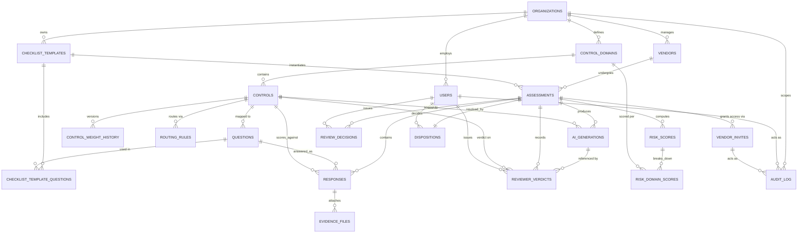
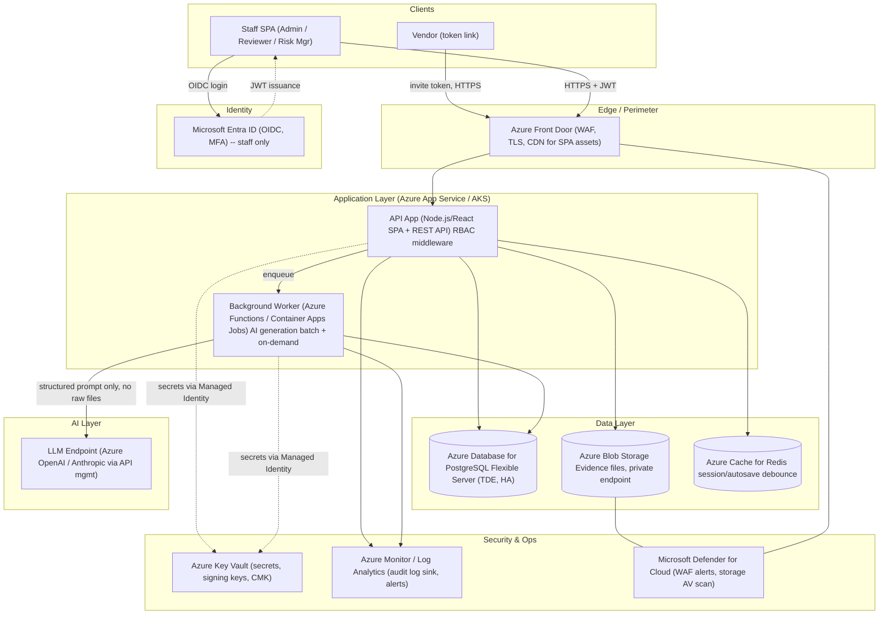

# VSA Platform — Solution Blueprint

Consolidated reference merging Requirements, Wireframes, Database, APIs, Security, and Azure Architecture for the Vendor Security Assessment (VSA) application. Source documents: `VSA Wireframes.dc.html`, `SCREENS.md`, `DB_SCHEMA.md`, `API_CONTRACTS.md`.

---

## 1. Requirements

### 1.1 Purpose
A Vendor Security Assessment (VSA) application within a broader GRC platform (built on Secure Controls Framework, SCF 2026.1). Supports the full lifecycle: vendor self-assessment → automated risk scoring → multi-stakeholder review → AI-assisted gap/remediation summary → final disposition.

### 1.2 Control Domain (reference example — Third-Party Management, SCF)
| Control | Description | Weight |
|---|---|---|
| TPM-01 | Third-Party Management | 10 |
| TPM-02 | Third-Party Criticality Assessments | 9 |
| TPM-04.1 | Third-Party Risk Assessments & Approvals | 9 |
| TPM-04.4 | Third-Party Processing/Storage/Service Locations | 10 |
| TPM-05 | Third-Party Contract Requirements | 10 |
| TPM-05.1 | Security Compromise Notification Agreements | 9 |
| TPM-06 | Third-Party Personnel Security | 9 |
| TPM-09 | Third-Party Deficiency Remediation | 9 |
| TPM-11 | Third-Party Incident Response & Recovery Capabilities | 8 |

Each checklist question maps to one SCF control (or a custom control) and inherits that control’s weighting for scoring.

### 1.3 Roles & Access
- **Vendor (Respondent)** — fills out the assigned checklist only; no visibility into risk scores, reviewer comments, or other vendors’ data.
- **Cybersecurity Reviewer** — reviews technical/security controls; sees AI-generated gap summary + remediation for controls in their domain.
- **Legal Reviewer** — reviews contractual/regulatory controls (e.g. TPM-05.x); AI summary scoped to legal-relevant controls.
- **Risk Manager** — reviews aggregate risk score, criticality tier, cross-domain gaps; holds final disposition authority (Approve / Conditional / Reject).
- **Admin** — manages control library, question bank, weightings, vendor assignments, stakeholder routing.

### 1.4 Vendor Checklist Workflow
- Vendor logs in via a secure, time-bound invite link (token-based, no standing account, expires after N days).
- Checklist grouped by control domain (Access Control, Third-Party Mgmt, Incident Response, …).
- Responses: Compliant / Non-Compliant / Not Applicable, plus optional evidence upload and free-text justification.
- Not Applicable requires mandatory justification (anti-gaming control).
- Autosave + partial-submission resume.
- Final submission is locked (immutable), timestamped and hashed for audit integrity.

### 1.5 Automated Risk Scoring
- Each question inherits its mapped control’s weight (1–10).
- Compliant = 0 risk contribution. Non-Compliant = full weight × severity multiplier. Not Applicable = excluded from the denominator (neither inflates nor deflates the score).
- Aggregate score normalized to 0–100, mapped to a tier (Low / Medium / High / Critical).
- Recalculates live pre-submission (admin visibility); finalizes on submission.
- Domain-level sub-scores shown alongside the overall score (e.g. "Third-Party Management: 62/100").

### 1.6 Stakeholder Review Window
Each reviewer role gets a dedicated view filtered to their control domains:
- AI-generated control summary (plain-language synthesis per domain).
- AI-generated gap analysis (Non-Compliant controls, associated weight, why it matters).
- AI-generated remediation recommendations (concrete, control-mapped).
- Reviewer can accept / edit / override the AI summary (human-in-the-loop).
- Decision field: Approve / Request More Info / Escalate / Reject, with comment log.
- Full audit trail: who reviewed, when, what AI output was shown, what was overridden.

### 1.7 AI Integration Requirements
- AI generation runs on submission (batch) and is regenerable on demand if vendor evidence updates.
- Prompts include question text, control ID, vendor response, justification/evidence metadata, and control weight — **not** raw uploaded files unless explicitly scoped for document analysis.
- AI output always labeled "AI-Generated — Human Review Required"; never auto-finalizes a decision.
- Every AI-generated output (prompt + response) is logged for audit/explainability.

### 1.8 Non-Functional / Security Requirements
- RBAC enforced server-side, not just UI-hidden — vendor accounts must never receive reviewer-only payloads via API.
- (Expanded fully in §5 Security.)

---

## 2. Wireframes

Low-fidelity, structural wireframes (`VSA Wireframes.dc.html`) covering all four surfaces, with 10 explored layouts grouped by focus area:

**Group A — Vendor checklist (question / evidence / justification layout)**
- **1a** Stacked cards + domain-progress rail — one question expanded at a time, collapsed siblings, autosave indicator, token-expiry badge.
- **1b** Two-pane guided wizard — question list rail (done/current/upcoming) + one focused question per screen; linear, low-anxiety completion.
- **1c** Dense grid — every question as a table row with inline response + expand-in-place evidence/justification; for power/returning respondents.

**Group B — Reviewer AI gap/remediation presentation (raw ⇄ AI toggle, human-in-the-loop)**
- **1d** Three-column sidecar — domain rail, read-only vendor response pane, AI panel (Summary/Gaps/Remediation tabs) beside it, never replacing it.
- **1e** AI-first briefing — executive summary up top, ranked gap cards (weight-sorted) with inline remediation; toggle to raw to verify.
- **1f** Per-control accordion — each control row expands to vendor claim + AI gap/fix + reviewer verdict together; densest audit-trail-friendly option.

**Group C — Risk score & domain sub-score visualization**
- **1g** Single-vendor verdict — score hero (0–100 + tier), domain sub-score bars ranked worst-first, disposition action bar.
- **1h** Portfolio table — every vendor as a row (score, tier, worst domain, status); Risk Manager’s queue, drills into 1g.
- **1i** Contribution breakdown — segmented bar showing exactly how much each domain contributes to the score, for auditor-defensible explainability.

**Group D — Admin console**
- **1j** Control library as spine — SCF-mapped controls with editable weight, tabbed across to Question Bank / Assignments / Routing.

Full per-screen detail (purpose, components, fields, buttons, user actions, validation, API calls) is in §7 below (merged from SCREENS.md).

---

## 3. Database (PostgreSQL)

## 1. Entities Overview

| Entity | Purpose |
|---|---|
| `organizations` | Tenant boundary (the company running the GRC platform) |
| `users` | Internal staff: Admin, Cybersecurity Reviewer, Legal Reviewer, Risk Manager |
| `roles` | Fixed RBAC role enum table |
| `vendors` | Third parties being assessed |
| `vendor_invites` | Time-bound token access for vendor respondents (no standing account) |
| `control_domains` | Logical groupings (Access Control, Third-Party Mgmt, Incident Response, etc.) |
| `controls` | SCF (or custom) controls with weight, versioned |
| `control_weight_history` | Append-only version log of weight/routing changes |
| `questions` | Question bank, each mapped 1:1 to a control |
| `checklist_templates` | A named, versioned bundle of questions assigned to vendors |
| `checklist_template_questions` | Join: which questions belong to which template, in what order |
| `assessments` | One vendor's run of a checklist template (the "case") |
| `responses` | Vendor's answer to a single question within an assessment |
| `evidence_files` | Metadata only for uploaded evidence (no raw file content in DB) |
| `routing_rules` | Which reviewer role(s) a control/domain routes to |
| `ai_generations` | Immutable log of every AI prompt + response (summary/gap/remediation) |
| `reviewer_verdicts` | Reviewer's accept/edit/override action per control per assessment |
| `review_decisions` | Reviewer-role-level decision (Approve/Request Info/Escalate/Reject) per assessment |
| `risk_scores` | Computed aggregate + domain sub-score snapshot per assessment |
| `dispositions` | Risk Manager's final Approve/Conditional/Reject decision |
| `audit_log` | Immutable, append-only trail for every state-changing action platform-wide |

---

## 2. DDL

```sql
-- ============================================================
-- EXTENSIONS
-- ============================================================
create extension if not exists "pgcrypto"; -- for gen_random_uuid()

-- ============================================================
-- ENUM TYPES
-- ============================================================
create type user_role as enum ('admin', 'cyber_reviewer', 'legal_reviewer', 'risk_manager');

create type response_value as enum ('compliant', 'non_compliant', 'not_applicable');

create type control_source as enum ('scf', 'custom');

create type assessment_status as enum (
  'draft', 'sent', 'in_progress', 'submitted',
  'in_review', 'escalated', 'approved', 'conditional', 'rejected'
);

create type reviewer_action as enum ('accept', 'edit', 'override');

create type review_decision_value as enum ('approve', 'request_info', 'escalate', 'reject');

create type disposition_value as enum ('approve', 'conditional', 'reject');

create type ai_generation_kind as enum ('summary', 'gap_analysis', 'remediation', 'briefing', 'cross_domain_note');

create type criticality_tier as enum ('low', 'medium', 'high', 'critical');

-- ============================================================
-- ORGANIZATIONS & USERS
-- ============================================================
create table organizations (
  id           uuid primary key default gen_random_uuid(),
  name         text not null,
  created_at   timestamptz not null default now()
);

create table users (
  id             uuid primary key default gen_random_uuid(),
  organization_id uuid not null references organizations(id) on delete cascade,
  email          citext not null,
  full_name      text not null,
  role           user_role not null,
  is_active      boolean not null default true,
  created_at     timestamptz not null default now(),
  updated_at     timestamptz not null default now(),
  unique (organization_id, email)
);

create index idx_users_org_role on users(organization_id, role);

-- ============================================================
-- VENDORS & TOKEN-BASED INVITES
-- ============================================================
create table vendors (
  id               uuid primary key default gen_random_uuid(),
  organization_id  uuid not null references organizations(id) on delete cascade,
  name             text not null,
  primary_contact_email citext,
  criticality_tier criticality_tier,           -- set by TPM-02 criticality assessment
  created_at       timestamptz not null default now(),
  updated_at       timestamptz not null default now()
);

create index idx_vendors_org on vendors(organization_id);

create table vendor_invites (
  id             uuid primary key default gen_random_uuid(),
  vendor_id      uuid not null references vendors(id) on delete cascade,
  assessment_id  uuid not null references assessments(id) on delete cascade,
  token_hash     text not null unique,          -- hash of the bearer token, never store raw token
  issued_by      uuid references users(id),
  issued_at      timestamptz not null default now(),
  expires_at     timestamptz not null,
  redeemed_at    timestamptz,                   -- first successful access
  revoked_at     timestamptz
);

create index idx_invites_expiry on vendor_invites(expires_at);

-- ============================================================
-- CONTROL LIBRARY
-- ============================================================
create table control_domains (
  id               uuid primary key default gen_random_uuid(),
  organization_id  uuid not null references organizations(id) on delete cascade,
  name             text not null,               -- e.g. "Third-Party Management"
  sort_order       int not null default 0,
  unique (organization_id, name)
);

create table controls (
  id               uuid primary key default gen_random_uuid(),
  organization_id  uuid not null references organizations(id) on delete cascade,
  control_domain_id uuid not null references control_domains(id),
  control_code     text not null,               -- e.g. 'TPM-05.1', 'CUS-02'
  title            text not null,
  description      text,
  source           control_source not null default 'scf',
  framework_ref    text,                        -- e.g. 'SCF 2026.1'
  current_weight   smallint not null check (current_weight between 1 and 10),
  is_deprecated    boolean not null default false, -- soft-delete only; never hard-deleted if in use
  created_at       timestamptz not null default now(),
  updated_at       timestamptz not null default now(),
  unique (organization_id, control_code)
);

create index idx_controls_domain on controls(control_domain_id);

-- Append-only version history for weight/routing edits (Admin console 1j)
create table control_weight_history (
  id             uuid primary key default gen_random_uuid(),
  control_id     uuid not null references controls(id) on delete cascade,
  weight         smallint not null check (weight between 1 and 10),
  changed_by     uuid not null references users(id),
  changed_at     timestamptz not null default now(),
  reason         text
);

create index idx_weight_history_control on control_weight_history(control_id, changed_at);

-- Which reviewer role(s) a control routes to (Admin console 1j — Routing tab)
create table routing_rules (
  id           uuid primary key default gen_random_uuid(),
  control_id   uuid not null references controls(id) on delete cascade,
  role         user_role not null check (role in ('cyber_reviewer','legal_reviewer','risk_manager')),
  unique (control_id, role)
);

-- ============================================================
-- QUESTION BANK & CHECKLIST TEMPLATES
-- ============================================================
create table questions (
  id             uuid primary key default gen_random_uuid(),
  organization_id uuid not null references organizations(id) on delete cascade,
  control_id     uuid not null references controls(id),
  question_text  text not null,
  help_text      text,
  requires_evidence boolean not null default false,
  is_active      boolean not null default true,
  created_at     timestamptz not null default now(),
  updated_at     timestamptz not null default now()
);

create index idx_questions_control on questions(control_id);

create table checklist_templates (
  id              uuid primary key default gen_random_uuid(),
  organization_id uuid not null references organizations(id) on delete cascade,
  name            text not null,               -- e.g. "Standard Third-Party VSA v3"
  version         int not null default 1,
  is_active       boolean not null default true,
  created_at      timestamptz not null default now()
);

create table checklist_template_questions (
  id                    uuid primary key default gen_random_uuid(),
  checklist_template_id uuid not null references checklist_templates(id) on delete cascade,
  question_id           uuid not null references questions(id),
  sort_order             int not null default 0,
  unique (checklist_template_id, question_id)
);

-- ============================================================
-- ASSESSMENTS (a vendor's run of a checklist)
-- ============================================================
create table assessments (
  id                    uuid primary key default gen_random_uuid(),
  organization_id       uuid not null references organizations(id) on delete cascade,
  vendor_id             uuid not null references vendors(id) on delete cascade,
  checklist_template_id uuid not null references checklist_templates(id),
  status                assessment_status not null default 'draft',
  assigned_by           uuid references users(id),
  assigned_at           timestamptz,
  submitted_at          timestamptz,
  submission_hash       text,                  -- integrity hash computed at submission (tamper-evidence)
  created_at            timestamptz not null default now(),
  updated_at            timestamptz not null default now()
);

create index idx_assessments_vendor on assessments(vendor_id);
create index idx_assessments_status on assessments(organization_id, status);

-- (vendor_invites references assessments — see above, created after this table logically;
--  in practice define assessments before vendor_invites or use a deferred FK.)

-- ============================================================
-- RESPONSES & EVIDENCE
-- ============================================================
create table responses (
  id              uuid primary key default gen_random_uuid(),
  assessment_id   uuid not null references assessments(id) on delete cascade,
  question_id     uuid not null references questions(id),
  control_id      uuid not null references controls(id),      -- denormalized for scoring speed
  weight_at_response smallint not null,                        -- snapshot of control weight at response time
  response_value  response_value,
  justification   text,
  is_locked       boolean not null default false,               -- true once assessment submitted
  responded_at    timestamptz,
  created_at      timestamptz not null default now(),
  updated_at      timestamptz not null default now(),
  unique (assessment_id, question_id),
  constraint chk_na_requires_justification check (
    response_value <> 'not_applicable' or (justification is not null and length(trim(justification)) > 0)
  )
);

create index idx_responses_assessment on responses(assessment_id);
create index idx_responses_control on responses(control_id);

create table evidence_files (
  id             uuid primary key default gen_random_uuid(),
  response_id    uuid not null references responses(id) on delete cascade,
  file_name      text not null,
  file_size_bytes bigint not null,
  mime_type      text not null,
  storage_uri    text not null,      -- pointer to object storage; raw bytes never in Postgres
  uploaded_at    timestamptz not null default now(),
  deleted_at     timestamptz         -- soft delete, only allowed pre-submission
);

create index idx_evidence_response on evidence_files(response_id);

-- ============================================================
-- AI GENERATIONS (explainability / audit)
-- ============================================================
create table ai_generations (
  id              uuid primary key default gen_random_uuid(),
  assessment_id   uuid not null references assessments(id) on delete cascade,
  control_id      uuid references controls(id),                -- null when scope = whole domain/briefing
  control_domain_id uuid references control_domains(id),
  kind            ai_generation_kind not null,
  model_name      text not null,                                -- e.g. 'claude-sonnet-4.5'
  prompt          jsonb not null,                                -- structured: question text, control id, response, justification, evidence metadata, weight
  response_text   text not null,
  generated_at    timestamptz not null default now(),
  is_stale        boolean not null default false,                -- true once underlying evidence changes
  superseded_by   uuid references ai_generations(id)
);

create index idx_ai_gen_assessment on ai_generations(assessment_id, kind);

-- ============================================================
-- REVIEWER VERDICTS & DECISIONS
-- ============================================================
create table reviewer_verdicts (
  id              uuid primary key default gen_random_uuid(),
  assessment_id   uuid not null references assessments(id) on delete cascade,
  control_id      uuid not null references controls(id),
  reviewer_id     uuid not null references users(id),
  ai_generation_id uuid references ai_generations(id),          -- exact AI output shown at time of verdict
  action          reviewer_action not null,
  final_text      text,                                          -- edited/override text if applicable
  comment         text,                                          -- required when action = 'override'
  created_at      timestamptz not null default now(),
  constraint chk_override_requires_comment check (
    action <> 'override' or (comment is not null and length(trim(comment)) > 0)
  ),
  unique (assessment_id, control_id, reviewer_id)
);

create index idx_verdicts_assessment on reviewer_verdicts(assessment_id);

create table review_decisions (
  id             uuid primary key default gen_random_uuid(),
  assessment_id  uuid not null references assessments(id) on delete cascade,
  reviewer_id    uuid not null references users(id),
  reviewer_role  user_role not null check (reviewer_role in ('cyber_reviewer','legal_reviewer')),
  decision       review_decision_value not null,
  comment        text,
  decided_at     timestamptz not null default now(),
  unique (assessment_id, reviewer_role)
);

-- ============================================================
-- RISK SCORES (computed snapshot, recalculable)
-- ============================================================
create table risk_scores (
  id                uuid primary key default gen_random_uuid(),
  assessment_id     uuid not null references assessments(id) on delete cascade,
  aggregate_score    numeric(5,2) not null check (aggregate_score between 0 and 100),
  tier              criticality_tier not null,
  is_final          boolean not null default false,   -- false = live/admin-visible recalculation; true = finalized on submit
  computed_at       timestamptz not null default now()
);

create index idx_risk_scores_assessment on risk_scores(assessment_id, is_final);

create table risk_domain_scores (
  id             uuid primary key default gen_random_uuid(),
  risk_score_id  uuid not null references risk_scores(id) on delete cascade,
  control_domain_id uuid not null references control_domains(id),
  sub_score      numeric(5,2) not null check (sub_score between 0 and 100),
  contribution_pct numeric(5,2),                      -- % of overall risk contributed by this domain
  unique (risk_score_id, control_domain_id)
);

-- ============================================================
-- DISPOSITION (Risk Manager final call)
-- ============================================================
create table dispositions (
  id             uuid primary key default gen_random_uuid(),
  assessment_id  uuid not null references assessments(id) on delete cascade unique,
  risk_manager_id uuid not null references users(id),
  decision       disposition_value not null,
  comment        text,
  decided_at     timestamptz not null default now(),
  constraint chk_disposition_comment check (
    decision = 'approve' or (comment is not null and length(trim(comment)) > 0)
  )
);

-- ============================================================
-- AUDIT LOG (immutable, append-only, platform-wide)
-- ============================================================
create table audit_log (
  id             bigint generated always as identity primary key,
  organization_id uuid not null references organizations(id),
  actor_user_id  uuid references users(id),           -- null if actor is a vendor token
  actor_vendor_invite_id uuid references vendor_invites(id),
  action         text not null,                        -- e.g. 'response.update', 'ai.regenerate', 'review.override'
  entity_type    text not null,                         -- e.g. 'assessment', 'response', 'ai_generations'
  entity_id      uuid,
  before_value   jsonb,
  after_value    jsonb,
  occurred_at    timestamptz not null default now()
);

create index idx_audit_org_time on audit_log(organization_id, occurred_at desc);
create index idx_audit_entity on audit_log(entity_type, entity_id);

-- audit_log is append-only: revoke UPDATE/DELETE at the application role level
-- revoke update, delete on audit_log from app_write_role;
```

---

## 3. Key Relationships

- `organizations` 1—* `users`, `vendors`, `control_domains`, `controls`, `questions`, `checklist_templates` (tenant scoping on every table).
- `vendors` 1—* `assessments` 1—* `vendor_invites` (a fresh token per assessment cycle).
- `control_domains` 1—* `controls` 1—* `questions` (each question maps to exactly one control).
- `checklist_templates` *—* `questions` via `checklist_template_questions` (ordered join).
- `assessments` 1—* `responses` (one row per question in that run); `responses` 1—* `evidence_files`.
- `controls` 1—* `control_weight_history` (append-only weight versioning) and 1—* `routing_rules` (role fan-out).
- `assessments` 1—* `ai_generations`, scoped optionally by `control_id` or `control_domain_id`.
- `assessments` 1—* `reviewer_verdicts` (per control, per reviewer) referencing the exact `ai_generations` row shown.
- `assessments` 1—* `review_decisions` (max one per reviewer role — enforced by unique constraint) and exactly 1 `dispositions` (unique FK).
- `assessments` 1—* `risk_scores` (multiple snapshots: live/admin recalcs plus one `is_final = true`) 1—* `risk_domain_scores`.
- `audit_log` references any entity polymorphically (`entity_type` + `entity_id`) and is insert-only.

**RBAC enforcement note:** row-level security (RLS) policies should be added per table keyed on `organization_id` plus role-specific predicates — e.g. vendors' API role only ever queries through `vendor_invites.token_hash`, never `users.id`; `reviewer_verdicts`/`review_decisions` filtered by `routing_rules` matching the reviewer's role.

---

## 4. ER Diagram



---

## 5. Design Notes

- **Score snapshotting:** `risk_scores` is append-only with an `is_final` flag rather than a single mutable row on `assessments`, so live admin recalculation (spec §3) never overwrites the number reviewers/Risk Manager last saw, and the finalized score is preserved verbatim for audit even if controls are re-weighted later.
- **Weight snapshot on response:** `responses.weight_at_response` freezes the control's weight at answer time, so a later Admin re-weighting (`control_weight_history`) never silently changes a locked assessment's score — matches the "non-retroactive" rule in `SCREENS.md` (1j).
- **Evidence stays out of the DB:** `evidence_files` stores only metadata + an object-storage pointer; raw files are never sent to the LLM unless explicitly scoped (per AI Integration Requirements §5), and `ai_generations.prompt` is `jsonb` capturing exactly what was sent (question text, control ID, response, justification, evidence metadata, weight — no file bytes).
- **Tamper-evidence:** `assessments.submission_hash` (e.g. SHA-256 over the finalized response set) plus `responses.is_locked` gives a verifiable, immutable submission; any later change requires a new `assessments` row (re-assessment cycle) rather than mutating history.
- **Human-in-the-loop guarantee:** `reviewer_verdicts.ai_generation_id` pins the verdict to the *exact* AI output shown, satisfying the audit requirement to reconstruct "why did the AI say this" and "what did the human do with it" together.


---

## 4. APIs (REST)

Base URL: `/api/v1`. All request/response bodies are JSON. All staff endpoints require `Authorization: Bearer <jwt>` (contains `sub`=user id, `org_id`, `role`). Vendor endpoints require `Authorization: Bearer <invite_token>` (opaque, resolved server-side to `vendor_invites.token_hash`; never a JWT, never carries elevated claims). Every state-changing call writes an `audit_log` row per `DB_SCHEMA.md` §5.

Standard error shape:
```json
{ "error": { "code": "string", "message": "string", "fields": { "field": "reason" } } }
```
Standard status codes used throughout: `200` OK, `201` Created, `204` No Content, `400` validation error, `401` unauthenticated, `403` unauthorized (RBAC), `404` not found, `409` conflict (e.g. already submitted), `422` business-rule violation.

---

## Screen 1a/1b/1c — Vendor Checklist (shared contract; all three UI layouts consume the same API)

**Authorization for all endpoints in this section:** Bearer = vendor invite token. Token must resolve to a non-expired, non-revoked `vendor_invites` row. Server derives `assessment_id`/`vendor_id` from the token — **never accepted as client input** (prevents a vendor from requesting another vendor's data). No reviewer/admin payload fields (scores, weights, AI content, other vendors) are ever included in these responses.

### `GET /vendor/session`
Validates token and loads assessment shell + progress.

Request: no body. `Authorization: Bearer <token>`.

Response `200`:
```json
{
  "assessment_id": "uuid",
  "vendor_name": "Acme Corp",
  "status": "in_progress",
  "expires_at": "2026-07-11T00:00:00Z",
  "domains": [
    { "control_domain_id": "uuid", "name": "Third-Party Mgmt", "answered_count": 6, "total_count": 12 }
  ]
}
```
Validation: token format check only (opaque string, expected length).
Errors: `401` invalid/unknown token; `410` (custom) token expired/revoked; `409` if `status` is already `submitted` (client should route to a read-only "already submitted" view).

### `GET /vendor/checklist?domain_id=:uuid`
Fetches questions for a domain (1a/1b) or full flattened set when `domain_id` omitted (1c).

Response `200`:
```json
{
  "questions": [
    {
      "question_id": "uuid",
      "control_code": "TPM-05.1",
      "weight": 9,
      "question_text": "Does the contract require breach notification within a defined SLA?",
      "requires_evidence": false,
      "response": {
        "response_value": "non_compliant",
        "justification": "No formal SLA in current MSA…",
        "evidence": [ { "file_id": "uuid", "file_name": "msa.pdf", "uploaded_at": "…" } ],
        "is_locked": false
      }
    }
  ]
}
```
Validation: `domain_id` must belong to this vendor's assigned checklist template if provided.
Authorization: same as above; 403 if `domain_id` not part of this assessment.

### `PATCH /vendor/responses/:questionId`
Autosaves a single response (debounced client-side).

Request:
```json
{ "response_value": "non_compliant", "justification": "No formal SLA in current MSA…" }
```
Response `200`: echoes saved `response` object (as in checklist fetch) + `saved_at`.

Validation:
- `response_value` ∈ `{compliant, non_compliant, not_applicable}`, required.
- `justification` required, non-empty, when `response_value = not_applicable` → `400` with `fields.justification`.
- Rejected with `409` if the parent assessment is already submitted (`is_locked = true` on the response row) — no silent edits post-submission.
- `question_id` must belong to this assessment's template → `404` otherwise.

Authorization: vendor token only; must own the assessment containing this question.

### `POST /vendor/evidence/:questionId` (multipart/form-data)
Request: `file` (binary), `question_id` path param.
Response `201`:
```json
{ "file_id": "uuid", "file_name": "msa.pdf", "file_size_bytes": 481200, "mime_type": "application/pdf", "uploaded_at": "…" }
```
Validation: mime type ∈ allow-list (`pdf, png, jpg, jpeg, docx`), size ≤ 25MB → `400` otherwise. Rejected `409` if assessment locked.
Authorization: vendor token; question must belong to assessment.

### `DELETE /vendor/evidence/:fileId`
Response `204`. Validation: only allowed pre-submission (`409` if locked). Authorization: file must belong to a response within this vendor's assessment.

### `GET /vendor/submit/validate`
Dry-run completeness check (used by 1c's inline error list).

Response `200`:
```json
{ "complete": false, "incomplete_controls": ["TPM-06", "TPM-09"] }
```

### `POST /vendor/submit`
Request: no body (or `{ "confirm": true }`).
Response `200`:
```json
{ "assessment_id": "uuid", "status": "submitted", "submitted_at": "…", "submission_hash": "sha256:…" }
```
Validation: all required questions answered (N/A justified) → `422` with `incomplete_controls` list otherwise, matching `/submit/validate`.
Side effects: sets all `responses.is_locked = true`, computes `submission_hash`, transitions `assessments.status`, triggers async AI generation batch job (§ AI Integration).
Authorization: vendor token; idempotency — second call returns `409` (`already_submitted`).

---

## Screen 1d/1e/1f — Reviewer Window (Cyber / Legal)

**Authorization for all endpoints in this section:** Bearer = staff JWT with `role ∈ {cyber_reviewer, legal_reviewer}`. Server filters every response to controls where a `routing_rules` row matches the caller's role for that control — enforced in the query itself (`WHERE routing_rules.role = :callerRole`), not stripped client-side. A Cyber Reviewer request for a Legal-only control returns `403`, never a filtered-but-fetched payload.

### `GET /review/:vendorId/domain/:domainRole`
`domainRole` is implicit from JWT role (path uses `:vendorId` only in practice; role scoping is automatic) — shown here as the effective scope.

Response `200`:
```json
{
  "vendor_name": "Acme Corp",
  "criticality_tier": "high",
  "controls": [
    {
      "control_id": "uuid", "control_code": "TPM-05.1", "weight": 9,
      "response_value": "non_compliant",
      "justification": "…",
      "evidence": [ { "file_id": "uuid", "file_name": "msa.pdf" } ],
      "verdict": { "action": "accept", "reviewer_id": "uuid", "created_at": "…" } 
    }
  ]
}
```
Validation: `vendorId` must have a submitted assessment (`404` if no submitted assessment exists yet — reviewers never see in-progress vendor data).
Authorization: 403 if caller's role has zero routed controls for this vendor (nothing to review).

### `GET /ai/summary/:vendorId?domain=:domainRole&format=briefing|tabbed`
Response `200`:
```json
{
  "kind": "summary",
  "generated_at": "…",
  "is_stale": false,
  "content": {
    "executive_summary": "…",
    "gaps": [
      { "control_code": "TPM-05.1", "weight": 9, "severity": "critical", "narrative": "…", "remediation": "…" }
    ]
  },
  "disclosure": "AI-Generated — Human Review Required"
}
```
Validation: returns `404` if no AI generation exists yet for this scope (client should show "pending" state, not an error banner, if assessment just submitted and batch job hasn't completed).
Authorization: same role-scoping as `/review/:vendorId/domain/:domainRole`; AI content for controls outside caller's role is never included.

### `POST /ai/regenerate/:vendorId?domain=:domainRole`
Request: `{ "reason": "vendor updated evidence" }` (optional, logged).
Response `202`:
```json
{ "job_id": "uuid", "status": "queued" }
```
Validation: `409` if evidence/response hash unchanged since last generation (nothing to regenerate) unless `force: true` passed.
Authorization: reviewer or admin role only. Every call logged to `audit_log` with prompt inputs (control id, question text, response, justification, evidence metadata, weight — never raw file bytes) per AI Integration Requirements §5.

### `POST /review/:vendorId/control/:controlId/verdict`
Request:
```json
{ "action": "override", "final_text": "Recommend requiring 72h SLA clause…", "comment": "AI understated legal exposure" }
```
Response `201`:
```json
{ "verdict_id": "uuid", "control_id": "uuid", "action": "override", "created_at": "…" }
```
Validation:
- `action` ∈ `{accept, edit, override}`, required.
- `comment` required, non-empty, when `action = override` → `400` (`fields.comment`).
- `final_text` required when `action ∈ {edit, override}`.
- `control_id` must be in caller's routed scope → `403` otherwise.
- Upserts (unique per `assessment_id + control_id + reviewer_id` — resubmitting updates prior verdict, both versions retained via `audit_log`, not via mutation of history).

### `POST /review/:vendorId/decision`
Request: `{ "decision": "escalate", "comment": "Needs contract renegotiation before approval" }`
Response `201`: `{ "decision_id": "uuid", "decided_at": "…" }`
Validation:
- `decision` ∈ `{approve, request_info, escalate, reject}`.
- `422` if any non-compliant control in caller's routed scope has no `reviewer_verdicts` entry yet ("resolve all gaps before deciding").
- One decision per role per assessment — a second call `409`s unless an explicit `reopen` flag is set by an Admin-only endpoint.

### `GET /audit/log/:vendorId?controlId=:controlId`
Response `200`: paginated list of `audit_log` rows scoped to entities the caller's role can see (a reviewer sees audit entries for controls in their domain only, plus their own actions).
Authorization: reviewers see domain-scoped entries only; Risk Manager/Admin see full trail.

---

## Screen 1g — Risk Manager: Single-Vendor Verdict

**Authorization:** JWT role = `risk_manager` (or `admin`). Full cross-domain visibility for vendors within the caller's organization.

### `GET /risk/:vendorId/score`
Response `200`:
```json
{
  "assessment_id": "uuid",
  "aggregate_score": 71.0,
  "tier": "high",
  "is_final": true,
  "computed_at": "…",
  "domain_scores": [
    { "control_domain_id": "uuid", "name": "Third-Party Mgmt", "sub_score": 82.0 },
    { "control_domain_id": "uuid", "name": "Access Control", "sub_score": 15.0 }
  ]
}
```
Validation: `404` if assessment not yet submitted (no final score exists). Sorted descending by `sub_score` server-side (matches wireframe 1g's "worst first").

### `GET /risk/:vendorId/reviewer-status`
Response `200`:
```json
{ "cyber_reviewer": { "decided": true, "decision": "approve" }, "legal_reviewer": { "decided": false } }
```

### `POST /risk/:vendorId/disposition`
Request: `{ "decision": "conditional", "comment": "Approve pending signed breach-notification addendum" }`
Response `201`: `{ "disposition_id": "uuid", "decided_at": "…" }`
Validation:
- `decision` ∈ `{approve, conditional, reject}`.
- `comment` required, non-empty, unless `decision = approve` → `400`.
- `422` (`reviewers_incomplete`) if either `cyber_reviewer` or `legal_reviewer` decision is missing.
- `409` if a disposition already exists for this assessment (final — requires a formal reopen/re-assessment, not a second POST).
Authorization: `risk_manager` only; write locks the assessment (`status` → `approved|conditional|rejected`) and blocks further vendor/reviewer writes.

---

## Screen 1h — Risk Manager: Vendor Portfolio Table

### `GET /risk/portfolio?sort=score|tier|status&filter_tier=:tier&q=:searchTerm&page=:n&page_size=:n`
Response `200`:
```json
{
  "page": 1, "page_size": 25, "total": 84,
  "vendors": [
    { "vendor_id": "uuid", "name": "Acme Corp", "score": 71.0, "tier": "high", "worst_domain": { "name": "Third-Party Mgmt", "sub_score": 82.0 }, "status": "in_review" },
    { "vendor_id": "uuid", "name": "Delta Sys", "score": null, "tier": null, "worst_domain": null, "status": "sent" }
  ]
}
```
Validation: `sort` and `filter_tier` restricted to enum values → `400` on invalid value. `page_size` capped at 100.
Authorization: `risk_manager`/`admin`; result set implicitly scoped to `organization_id` from JWT — never accepts a client-supplied org filter.

---

## Screen 1i — Risk Manager: Score Contribution Breakdown

### `GET /risk/:vendorId/score-breakdown`
Response `200`:
```json
{
  "aggregate_score": 71.0,
  "domains": [
    { "name": "Third-Party Mgmt", "contribution_pct": 46.0, "driving_controls": ["TPM-05.1", "TPM-06"] },
    { "name": "Incident Response", "contribution_pct": 26.0, "driving_controls": ["TPM-11"] }
  ]
}
```
Validation: `contribution_pct` values computed server-side, sum to 100 (of the risk portion) — never accepted from client. `404` if assessment not finalized (per SCREENS.md, breakdown is post-submission only, not live).

### `GET /ai/cross-domain-note/:vendorId`
Response `200`: `{ "note": "2 of top-3 gaps share a contract-clause root cause", "disclosure": "AI-Generated — Human Review Required" }`

### `GET /risk/:vendorId/export?format=pdf|csv`
Response `200`, `Content-Type: application/pdf` or `text/csv` (binary/file stream, not JSON).
Authorization: `risk_manager`/`admin`; every export call logged to `audit_log` (exports are a common audit ask).

---

## Screen 1j — Admin Console: Control Library, Weights & Routing

**Authorization for all endpoints in this section:** JWT role = `admin` only. Every other role receives `403` regardless of UI state (server-enforced, not hidden-tab).

### `GET /admin/controls?domain_id=:uuid&include_deprecated=false`
Response `200`:
```json
{
  "controls": [
    { "control_id": "uuid", "control_code": "TPM-05.1", "title": "…", "source": "scf", "weight": 9, "routed_to": ["legal_reviewer", "cyber_reviewer"], "is_deprecated": false }
  ]
}
```

### `PATCH /admin/controls/:controlId`
Request:
```json
{ "weight": 8, "routed_to": ["cyber_reviewer"], "reason": "Recalibrated per Q3 SCF update" }
```
Response `200`: updated control object + `{ "weight_history_id": "uuid" }`.
Validation:
- `weight` integer 1–10 → `400` otherwise.
- Change is **non-retroactive**: writes a new `control_weight_history` row; does not touch `responses.weight_at_response` on already-submitted assessments.
- `routed_to` values ∈ `{cyber_reviewer, legal_reviewer, risk_manager}`.

### `POST /admin/controls` (custom control)
Request:
```json
{ "control_domain_id": "uuid", "control_code": "CUS-03", "title": "…", "description": "…", "weight": 7, "routed_to": ["cyber_reviewer"] }
```
Response `201`: created control object.
Validation: `control_code` must match reserved custom prefix (e.g. `^CUS-\d+$`) and be unique within org → `409` on collision; `weight` 1–10.

### `DELETE /admin/controls/:controlId`
Response: `409` (`in_use`) if any `responses` reference this control — soft-delete only. Otherwise `200` sets `is_deprecated = true` (no hard delete, ever).

### `GET /admin/questions?control_id=:uuid`
Response `200`: list of question bank entries for a control.

### `POST /admin/questions`
Request: `{ "control_id": "uuid", "question_text": "…", "requires_evidence": true }`
Response `201`: created question.
Validation: `control_id` must exist and not be deprecated.

### `POST /admin/vendors/:vendorId/assign-checklist`
Request: `{ "checklist_template_id": "uuid", "expires_in_days": 14, "contact_email": "security@vendor.com" }`
Response `201`:
```json
{ "assessment_id": "uuid", "invite_token": "opaque-token-shown-once", "expires_at": "…" }
```
Validation: `expires_in_days` 1–90; vendor must not already have an active (`sent`/`in_progress`) assessment on the same template → `409`.
Side effect: sends invite email (out of band); `invite_token` is returned once and not retrievable again (only re-issuable via a new POST that revokes the prior one).

### `POST /admin/routing-rules`
Request: `{ "control_id": "uuid", "roles": ["legal_reviewer"] }`
Response `200`: updated routing set for the control (idempotent replace, not append).

### `GET /audit/log?scope=admin-config&page=:n`
Response `200`: paginated full change history (control/weight/routing edits) — admin/full-trail view, no domain scoping.

---

## Cross-Cutting Contract Rules

- **RBAC is enforced in the query/service layer**, not the route layer: every list/detail endpoint above adds a role-derived predicate (vendor→own assessment only; reviewer→routed controls only; risk manager/admin→org-wide). A payload never includes fields the caller's role shouldn't see, even redacted — the field is absent from the serializer entirely.
- **Idempotency:** `POST /vendor/submit`, `POST /risk/:vendorId/disposition`, and `POST /review/:vendorId/decision` are one-shot per assessment; retries return `409` rather than creating duplicate finalized state.
- **AI disclosure is contractual, not just visual:** every `ai_generations`-backed response includes a `"disclosure"` field the client must render; no endpoint that returns AI content also accepts a field that would let AI output silently become a `dispositions` or `review_decisions` row without a corresponding `reviewer_verdicts`/human action first.
- **Audit on every mutation:** each `PATCH`/`POST`/`DELETE` above writes one `audit_log` row (`actor`, `action`, `entity_type`, `entity_id`, `before_value`, `after_value`) synchronously in the same transaction as the mutation — never fire-and-forget.
- **Pagination:** all list endpoints accept `page`/`page_size` (default 25, max 100) and return `total` for client-side pagers.
- **Versioning:** all routes are under `/api/v1`; breaking changes ship as `/api/v2` rather than mutating existing contracts.


---

## 5. Security

### 5.1 Identity & Access
- **Staff users** (Admin, Cyber Reviewer, Legal Reviewer, Risk Manager) authenticate via Azure AD / Entra ID (OIDC), issued a short-lived JWT (sub, org_id, role, exp ~15 min) plus a rotating refresh token (httpOnly, Secure, SameSite=Strict cookie).
- **Vendor respondents** never get a standing account. Access is a single-use, time-bound invite token (opaque, cryptographically random ≥256-bit, stored server-side only as a salted hash in `vendor_invites.token_hash` — the raw token is never persisted or logged). Token expires after N days (configurable, default 14) and is revocable by Admin.
- MFA required for all staff roles; enforced at the identity provider.

### 5.2 Authorization (RBAC, server-enforced)
- RBAC is enforced in the service/query layer, not the UI or route layer — every serializer is role-aware; fields the caller’s role shouldn’t see are absent from the payload, never merely hidden client-side (per API_CONTRACTS.md cross-cutting rules).
- Vendor tokens resolve server-side to exactly one assessment_id; that ID is never accepted as client input, preventing IDOR access to another vendor’s data.
- Reviewer scoping is data-driven via routing_rules (control → role), not hardcoded per screen, so Cyber vs. Legal boundaries stay correct as the control library evolves.
- Postgres Row-Level Security (RLS) policies mirror the application-layer RBAC as defense-in-depth: every table keyed by organization_id, with additional predicates for vendor- and role-scoped tables (responses, reviewer_verdicts, review_decisions).
- Admin-only endpoints (control library, weights, routing, vendor assignment) return 403 for every other role regardless of UI state.

### 5.3 Data Protection
- TLS 1.2+ enforced in transit everywhere (Azure Front Door / Application Gateway terminates, re-encrypts to backend).
- At rest: Azure Database for PostgreSQL Flexible Server with transparent data encryption (TDE); evidence files stored in Azure Blob Storage with Microsoft-managed or customer-managed keys (Azure Key Vault) and private endpoints only (no public blob access).
- Evidence files are **never sent to the LLM** — only structured metadata (file name, size, mime type) per AI Integration Requirements. Raw file bytes stay in Blob Storage behind a signed, short-lived SAS URL when a reviewer explicitly opens an attachment.
- Secrets (DB credentials, LLM API keys, signing keys) held in Azure Key Vault, injected via Managed Identity — never in app config or source.
- PII/vendor-contact data minimized; evidence retention policy configurable per org (e.g. purge N years post-disposition per contractual/regulatory need).

### 5.4 Tamper-Evidence & Audit Integrity
- On submission, the vendor’s full response set is hashed (SHA-256) into assessments.submission_hash; responses.is_locked flips true — the API layer rejects any further PATCH with 409, and the DB constraint layer backs this up.
- audit_log is append-only (application DB role has INSERT only — UPDATE/DELETE revoked at the Postgres grant level), capturing actor, action, entity, before/after value, and timestamp for every state-changing call, synchronously in the same transaction as the mutation.
- Every reviewer_verdicts row pins the exact ai_generations row shown to the reviewer at decision time, so "why did the AI say this" and "what did the human do about it" are reconstructable together for regulators.
- Re-assessment or reopening a finalized record is a new, logged, formal action (new assessments row or explicit reopen endpoint) — never a silent mutation of history.

### 5.5 AI-Specific Safeguards
- Every AI-backed response carries a persistent "AI-Generated — Human Review Required" disclosure; no endpoint lets AI output populate review_decisions/dispositions without a preceding human reviewer_verdicts action.
- LLM prompts are constructed server-side from a fixed, allow-listed field set (question text, control ID, response, justification, evidence metadata, weight) — free-form vendor text is never concatenated into a prompt that also contains system instructions, mitigating prompt injection from vendor-supplied justification text.
- Full prompt + response logged (ai_generations.prompt as jsonb, response_text) for explainability review; regeneration is versioned (superseded_by), never overwritten in place.

### 5.6 Application-Layer Hardening
- Rate limiting per token/JWT on all vendor and auth endpoints (mitigates invite-token brute forcing and credential stuffing).
- Input validation server-side on every field (see API_CONTRACTS.md per-endpoint Validation) — never trust client-side checks alone.
- File upload scanning (Azure Defender for Storage / antivirus scanning pipeline) before evidence is made retrievable to reviewers.
- CSRF protection on cookie-based staff sessions; CORS allow-list restricted to the platform’s own frontend origin(s).
- Standard OWASP ASVS-aligned controls: parameterized queries (no dynamic SQL), output encoding, security headers (CSP, HSTS, X-Content-Type-Options), dependency/SCA scanning in CI.

### 5.7 Compliance Alignment
- Control taxonomy and weighting model align to SCF 2026.1 Third-Party Management domain, informed by ISO 27036 and NIST SP 800-161 vendor risk practices.
- Audit trail design (immutable log, AI explainability, human-in-the-loop sign-off) supports SOC 2 / ISO 27001 evidentiary requirements and regulator inquiries into AI-assisted determinations.

---

## 6. Azure Architecture

### 6.1 High-Level Component Diagram



### 6.2 Service Mapping

| Concern | Azure Service | Notes |
|---|---|---|
| Edge / WAF / TLS termination | Azure Front Door + WAF policy | Bot/rate-limit rules for vendor invite endpoints |
| SPA hosting | Azure Static Web Apps or App Service (static bundle) | Separate build per role bundle optional |
| REST API | Azure App Service (Linux, Node.js) or Azure Container Apps | Auto-scale on request queue depth; horizontally scalable, stateless (session in Redis) |
| Background AI jobs | Azure Container Apps Jobs / Azure Functions (queue-triggered) | Consumes Azure Service Bus queue for "assessment submitted" / "regenerate requested" events |
| Queueing | Azure Service Bus | Decouples submission-triggered AI batch generation from the request/response path |
| Relational data | Azure Database for PostgreSQL Flexible Server | Zone-redundant HA, PITR backups, TDE at rest, private endpoint only |
| Evidence file storage | Azure Blob Storage (private container, SAS-scoped reads) | Lifecycle policy for retention/purge; Defender for Storage AV scanning |
| Caching / autosave debounce / rate limiting | Azure Cache for Redis | Also backs staff session store |
| Identity | Microsoft Entra ID (OIDC) + custom vendor-token service | Entra ID for staff RBAC roles/groups mapped to users.role; vendor tokens issued/validated by the API itself |
| Secrets & keys | Azure Key Vault | DB creds, LLM API key, JWT signing key, blob CMK; accessed via Managed Identity, never static config |
| AI/LLM | Azure OpenAI Service (or Anthropic via API Management passthrough) | API Management layer enforces the fixed prompt-field allow-list and logs raw request/response for ai_generations |
| Observability | Azure Monitor, Log Analytics, Application Insights | Structured logs feed audit_log mirror for SIEM/alerting; anomaly alerts on privilege-escalation patterns |
| Threat protection | Microsoft Defender for Cloud | WAF alerting, storage malware scanning, DB advanced threat protection |
| CI/CD | Azure DevOps or GitHub Actions -> Azure | SCA/dependency scanning gate, IaC (Bicep/Terraform) for reproducible environments |

### 6.3 Network & Deployment Topology
- All application and data services deployed inside an Azure Virtual Network; PostgreSQL and Blob Storage reachable only via private endpoints (no public network access).
- Azure Front Door + WAF is the only public ingress; App Service/Container Apps restricted to accept traffic from Front Door via access restrictions.
- Multi-environment separation (dev / staging / prod) via separate resource groups + subscriptions where feasible, with production secrets isolated to a dedicated Key Vault.
- Blue/green or slot-based deployment on App Service for zero-downtime releases; database migrations run as a gated pipeline step ahead of slot swap.

### 6.4 Scaling & Resilience
- API layer stateless and horizontally auto-scaled; Redis holds session/autosave state so any instance can serve any request.
- AI generation runs asynchronously via Service Bus + worker so a slow/rate-limited LLM call never blocks the vendor/reviewer request path.
- PostgreSQL Flexible Server configured zone-redundant HA with point-in-time restore; Blob Storage geo-redundant (RA-GRS) for evidence durability.
- Front Door provides global anycast entry + WAF-based DDoS/bot mitigation in front of the app tier.

---

## 7. Screen-Level Detail (Wireframe ↔ Requirements ↔ API Traceability)

Reference wireframes: `VSA Wireframes.dc.html`. IDs below match wireframe option IDs (1a–1j).

---

## 1a — Vendor Checklist: Stacked Cards + Domain Rail

**Purpose:** Primary self-assessment surface for vendor respondents; one question expanded at a time within a domain, grouped by control domain, to reduce cognitive load for non-technical users.

**Components:** Domain progress rail (left), expanded question card, collapsed question list, autosave indicator, token expiry badge, submit footer.

**Fields:**
- Response selector: Compliant / Non-Compliant / Not Applicable (single-select)
- Evidence upload (drag-and-drop + browse, multi-file)
- Justification (free text, required if N/A, optional otherwise)

**Buttons:** Save & Exit, Submit (locks), Expand/Collapse question, domain nav items.

**User Actions:** Select response option; upload/remove evidence; enter justification; navigate between domains/questions; save and resume later; final submit.

**Validation Rules:**
- Response is required before a question counts as "answered."
- Justification is mandatory and non-empty when response = Not Applicable.
- Evidence file type/size limits enforced client- and server-side (e.g., pdf/png/jpg/docx, ≤25MB).
- Submit button disabled until all required questions across all domains are answered (or explicitly N/A with justification).
- On submit, all responses become read-only; no further edits accepted by API.

**API Calls:**
- `GET /api/vendor/session/:token` — validate invite token, load assigned checklist + prior draft.
- `PATCH /api/vendor/responses/:questionId` — autosave a single response (debounced).
- `POST /api/vendor/evidence/:questionId` — upload evidence file, returns file metadata (not content) for later AI prompt use.
- `DELETE /api/vendor/evidence/:fileId` — remove uploaded evidence pre-submission.
- `POST /api/vendor/submit` — finalize submission; server generates immutable hash + timestamp, rejects if already submitted or token expired.

---

## 1b — Vendor Checklist: Two-Pane Guided Wizard

**Purpose:** Linear, one-question-at-a-time flow for guided completion; reduces overwhelm for first-time or infrequent respondents.

**Components:** Left question-list rail (done/current/upcoming states), right focused-question panel, per-domain navigation (prev/next domain).

**Fields:** Same as 1a — response radio (Compliant/Non-Compliant/N-A), justification textarea, evidence attach.

**Buttons:** Next Question, Previous Question, prev/next domain, Save & Exit, Submit (on final question).

**User Actions:** Answer current question; attach evidence; move forward/back through the list; jump to any previously-visited question via the rail; submit at end of last domain.

**Validation Rules:**
- "Next" disabled until current question has a valid response (and justification if N/A).
- Rail shows question state (done / in-progress / not started) computed from saved responses.
- Cannot jump ahead of the first unanswered required question (soft guardrail; still resumable).
- Same immutability rule on final submit as 1a.

**API Calls:**
- `GET /api/vendor/session/:token`
- `GET /api/vendor/questions?domain=:domainId` — paginated question fetch per domain.
- `PATCH /api/vendor/responses/:questionId` — autosave on Next/Prev.
- `POST /api/vendor/evidence/:questionId`
- `POST /api/vendor/submit`

---

## 1c — Vendor Checklist: Dense Grid (Power Respondent Mode)

**Purpose:** High-density, all-questions-visible layout for returning vendors or admins-on-behalf-of-vendor completing large checklists quickly.

**Components:** Sortable/filterable question table (control ID, weight, question, response, evidence icon), inline expand-in-place row for justification/evidence.

**Fields:** Inline response dropdown per row (Compliant/Non-Compliant/N-A); expandable justification textarea; evidence dropzone (appears on expand or when N/A selected).

**Buttons:** Row expand/collapse (▾), Submit (locks), evidence icon (📎 upload / ✎ edit justification).

**User Actions:** Set response per row via dropdown; expand a row to add justification/evidence; filter/search questions; bulk-review before submit.

**Validation Rules:**
- Row cannot be marked N/A without expanding and completing justification (auto-expands and flags row).
- Visual warning state (highlighted row) for any incomplete required field.
- Submit blocked with inline error list if any required field is missing, listing offending control IDs.
- Immutable-lock behavior identical to 1a/1b.

**API Calls:**
- `GET /api/vendor/session/:token`
- `GET /api/vendor/checklist` — full flattened question set with weights and current responses.
- `PATCH /api/vendor/responses/:questionId`
- `POST /api/vendor/evidence/:questionId`
- `POST /api/vendor/submit`
- `GET /api/vendor/submit/validate` — pre-submit dry-run returning list of incomplete required fields.

---

## 1d — Reviewer Window: Three-Column Sidecar (Cyber/Legal)

**Purpose:** Domain-scoped review workspace where AI analysis sits beside (never replaces) the vendor's raw response, supporting human-in-the-loop verification.

**Components:** My-domains rail (flags non-compliant controls), vendor-response pane (read-only), AI sidecar with Summary/Gaps/Remediation tabs, raw⇄AI toggle, decision control.

**Fields:** None editable in vendor pane (read-only). AI sidecar: editable text area when reviewer chooses "Edit" on AI output. Decision dropdown: Approve / Request More Info / Escalate / Reject. Comment field (free text, logged).

**Buttons:** Accept, Edit, Override (per AI output), Decision ▾, tab switches (Summary/Gaps/Fix), Raw/AI toggle, Regenerate AI (⟳).

**User Actions:** Browse domain-scoped controls; inspect vendor response + evidence metadata; read AI summary/gap/remediation; accept AI text as-is, edit it, or override with own text; record decision + comment; regenerate AI output if evidence changed.

**Validation Rules:**
- Reviewer can only see controls mapped to their role's domain (server-enforced, not just UI filter).
- A decision requires at least Accept/Edit/Override to be resolved on every Non-Compliant control in-domain before the reviewer's overall recommendation can be submitted.
- Every Accept/Edit/Override action is logged with reviewer ID, timestamp, and the exact AI output shown at that time (immutable log entry).
- "Override" requires a comment explaining the deviation from AI output.

**API Calls:**
- `GET /api/review/:vendorId/domain/:domainRole` — scoped controls + vendor responses (RBAC-filtered server-side).
- `GET /api/ai/summary/:vendorId?domain=:domainRole` — fetch cached AI summary/gap/remediation.
- `POST /api/ai/regenerate/:vendorId?domain=:domainRole` — trigger on-demand regeneration (queues LLM call, logs prompt+response).
- `POST /api/review/:vendorId/control/:controlId/verdict` — { action: accept|edit|override, text, comment }.
- `POST /api/review/:vendorId/decision` — { decision, comment }.
- `GET /api/audit/log/:vendorId` — read-only trail for compliance display.

---

## 1e — Reviewer Window: AI-First Briefing

**Purpose:** Executive-style briefing for reviewers who want a synthesized narrative first, with ranked gap cards (weight-sorted) and inline remediation, toggling to raw data only to verify.

**Components:** Executive summary card, ranked gap-card list (severity-ordered), raw/AI toggle, regenerate control, decision footer.

**Fields:** Per-gap-card Accept/Edit/Override state; final decision (Approve/Request Info/Escalate/Reject) + comment.

**Buttons:** Raw/AI View toggle, Regenerate (⟳), Accept/Edit/Override per gap card, Request Info, Escalate, Submit Review.

**User Actions:** Read exec summary; scan ranked gaps by weight/severity; expand a gap card to view underlying raw response (via toggle); action each gap; submit overall review decision.

**Validation Rules:**
- Gap cards are sorted server-side by (weight × non-compliance); order not user-editable, ensuring highest-risk items surface first.
- Submit Review disabled until every "CRITICAL" and "MEDIUM"-flagged gap card has a recorded verdict.
- AI-generated label always visible and cannot be dismissed/hidden permanently (persists per session).
- Regenerate only enabled if vendor evidence/response changed since last AI generation (checked via version/hash comparison).

**API Calls:**
- `GET /api/review/:vendorId/domain/:domainRole`
- `GET /api/ai/summary/:vendorId?domain=:domainRole&format=briefing`
- `POST /api/ai/regenerate/:vendorId?domain=:domainRole`
- `POST /api/review/:vendorId/control/:controlId/verdict`
- `POST /api/review/:vendorId/decision`

---

## 1f — Reviewer Window: Per-Control Accordion

**Purpose:** Densest, most audit-trail-friendly layout — each control is a self-contained row with vendor claim, AI gap+fix, and reviewer verdict together, ideal for methodical control-by-control sign-off.

**Components:** Accordion list (one row per in-domain control), split panel per expanded row (vendor claim+evidence | AI gap+fix), verdict action bar per row, top-level AI disclosure banner + control/gap counter.

**Fields:** Per-row verdict (Accept AI / Edit / Override) with optional comment; rows collapse/expand independently.

**Buttons:** Row expand/collapse (▾/▸), Accept AI, Edit, Override (per row), Raw / Raw+AI toggle.

**User Actions:** Expand each control row in turn; compare vendor evidence against AI-flagged gap and suggested fix side-by-side; record verdict per control; collapse once resolved to track progress visually (resolved rows dim/collapse).

**Validation Rules:**
- All Non-Compliant-flagged rows must have a verdict before the reviewer's section is marked "complete" in the parent dashboard.
- Override requires a mandatory comment (same rule as 1d).
- Compliant-rated controls are collapsed by default and read-only (no AI gap generated, per spec — gaps only generated for non-compliant items).
- Every expand/verdict action timestamped in the audit trail (not just final decision).

**API Calls:**
- `GET /api/review/:vendorId/domain/:domainRole`
- `GET /api/ai/gaps/:vendorId?domain=:domainRole` — per-control gap+remediation objects only (lighter payload than full briefing).
- `POST /api/review/:vendorId/control/:controlId/verdict`
- `GET /api/audit/log/:vendorId?controlId=:controlId` — per-control audit detail on demand.

---

## 1g — Risk Manager: Single-Vendor Verdict

**Purpose:** Final disposition screen — normalized aggregate score, tier, and domain sub-scores ranked worst-first so the Risk Manager can see at a glance which domain is driving risk before deciding.

**Components:** Score hero (0–100 + tier badge), aggregate progress track, domain sub-score bars (sorted descending by risk), disposition action bar.

**Fields:** None directly editable except disposition decision + comment (required for Reject/Conditional).

**Buttons:** Approve ▾ (may include sub-options e.g. "Approve with conditions logged"), Conditional, Reject.

**User Actions:** Review aggregate score and per-domain breakdown; drill into a domain bar to jump to that domain's reviewer output; select final disposition; enter justification comment; confirm.

**Validation Rules:**
- Disposition requires all reviewer roles (Cyber, Legal) to have submitted their decisions first (blocked with explanatory message otherwise).
- Reject or Conditional requires a non-empty comment.
- Once disposition is submitted, the vendor record locks (no further checklist or reviewer edits) except through a formal re-assessment cycle.
- Score/tier shown must match the last-finalized calculation; any post-submission evidence change (re-assessment) requires explicit recalculation, never silent update.

**API Calls:**
- `GET /api/risk/:vendorId/score` — aggregate + domain sub-scores (normalized 0–100 + tier).
- `GET /api/risk/:vendorId/reviewer-status` — completion state per reviewer role.
- `POST /api/risk/:vendorId/disposition` — { decision: approve|conditional|reject, comment }.
- `GET /api/audit/log/:vendorId?scope=disposition`.

---

## 1h — Risk Manager: Vendor Portfolio Table

**Purpose:** Risk Manager's queue/landing view across all vendors — score, tier, worst domain, and review status at a glance, to prioritize which vendors need attention.

**Components:** Sortable/filterable vendor table (vendor name, score, tier, worst domain, status), status legend, row click-through to 1g.

**Fields:** Column sort controls; filter by tier/status; search by vendor name.

**Buttons:** Sort headers (Score, Tier, Status), row (opens vendor detail = 1g), "Assign vendor" / "Send checklist" (admin-adjacent action if permitted).

**User Actions:** Sort/filter the portfolio; search for a vendor; click a row to open that vendor's disposition screen; identify vendors stuck in "awaiting vendor" or "escalated" states.

**Validation Rules:**
- Only vendors assigned to or visible under this Risk Manager's scope are listed (org/BU-based RBAC filter, server-enforced).
- Score/tier column shows "—" for vendors with no finalized submission yet (not a fabricated placeholder score).
- Status values constrained to a fixed enum: Sent, Awaiting Vendor, In Review, Escalated, Approved, Conditional, Rejected.

**API Calls:**
- `GET /api/risk/portfolio?sort=:field&filter=:tier` — paginated vendor list with score/tier/status summary.
- `GET /api/risk/:vendorId/score` (on row click, prefetch for 1g).

---

## 1i — Risk Manager: Score Contribution Breakdown

**Purpose:** Explainability view — shows exactly how much each domain's non-compliant weight contributes to the final 0–100 score, making the number defensible to auditors/regulators.

**Components:** Aggregate score header, segmented contribution bar (proportional stacked bar by domain), domain contribution legend/list with named controls driving each contribution, AI cross-domain note.

**Fields:** None editable — this is a read-only analytical view.

**Buttons:** Export/print breakdown (for audit record), link-through from each domain segment to underlying controls (1d/1e/1f).

**User Actions:** Inspect which domains and specific controls contributed most to the score; click through to the underlying non-compliant controls; export the breakdown for audit documentation.

**Validation Rules:**
- Contribution percentages must sum to the displayed aggregate score's risk portion (100% of the "risk" bar, not of 100 points) — computed server-side, not client-derived, to prevent tampering.
- AI cross-domain note is labeled AI-generated and does not affect the numeric score (informational only).
- Breakdown is only viewable after checklist submission is finalized (no partial/live breakdown shown to Risk Manager — that's Admin's live-recalc view).

**API Calls:**
- `GET /api/risk/:vendorId/score-breakdown` — per-domain contribution + contributing control IDs.
- `GET /api/ai/cross-domain-note/:vendorId`.
- `GET /api/risk/:vendorId/export` — generates audit-ready PDF/CSV of the breakdown.

---

## 1j — Admin Console: Control Library, Weights & Routing

**Purpose:** Administrative surface for managing the SCF control library, question bank, weightings, vendor assignments, and stakeholder routing — the configuration backbone driving scoring and RBAC across all other screens.

**Components:** Tab bar (Control Library / Question Bank / Assignments / Routing), control table (control ID, description, source, weight slider/input, routed-to role), domain filter, custom-control creation.

**Fields:**
- Weight (1–10, numeric/slider input) per control.
- Source (read-only "SCF" tag for framework controls; editable label for custom controls).
- Routed-to role(s) (multi-select: Cyber / Legal / Risk Manager / both).
- Custom control: ID, name, description, weight, domain, routing (all editable on create).

**Buttons:** + Custom Control, tab switches, domain filter dropdown, per-row save/edit weight, per-row routing edit.

**User Actions:** Filter controls by domain; adjust a control's weight; change which reviewer role a control routes to; add a net-new custom control not in SCF; switch to Question Bank to manage question text mapped to controls; switch to Assignments to assign checklists to vendors; switch to Routing to configure org-wide stakeholder routing rules.

**Validation Rules:**
- Weight must be an integer 1–10.
- Weight changes are versioned, not destructive — historical scores on already-locked vendor submissions are never retroactively recalculated; only future assessments use the new weight.
- A control cannot be deleted if it has any responses tied to it (soft-delete/deprecate only).
- Custom control ID must be unique and follow a reserved prefix (e.g., `CUS-##`) to avoid collision with SCF IDs.
- Only Admin role can access this console; enforced server-side on every endpoint below.

**API Calls:**
- `GET /api/admin/controls?domain=:domainId` — list controls with weights/routing.
- `PATCH /api/admin/controls/:controlId` — update weight/routing (creates a new version record).
- `POST /api/admin/controls` — create custom control.
- `GET /api/admin/questions?controlId=:controlId` — question bank scoped to a control.
- `POST /api/admin/vendors/:vendorId/assign-checklist` — assign checklist + generate invite token.
- `POST /api/admin/routing-rules` — configure domain-to-role routing defaults.
- `GET /api/audit/log?scope=admin-config` — full change history for compliance review.

---

## Cross-Cutting Notes (apply to all screens)

- **RBAC:** every API call above is scoped server-side by role + vendor/domain assignment; a Vendor token can never receive Reviewer/Admin payloads, and a Cyber Reviewer never receives Legal-only control data (and vice versa) regardless of UI state.
- **Audit logging:** all state-changing calls (`PATCH`/`POST`/`DELETE`) write an immutable audit record: actor, timestamp, before/after value, and — for AI-related calls — the exact prompt and response shown to the user.
- **AI disclosure:** any AI-generated content is rendered with a persistent "AI-Generated — Human Review Required" label and is never used to auto-finalize a decision field.
- **Immutability:** once a vendor checklist is submitted, or a Risk Manager disposition is recorded, the underlying record is locked; further changes require a formal, logged re-assessment/reopen action, not a silent edit.

